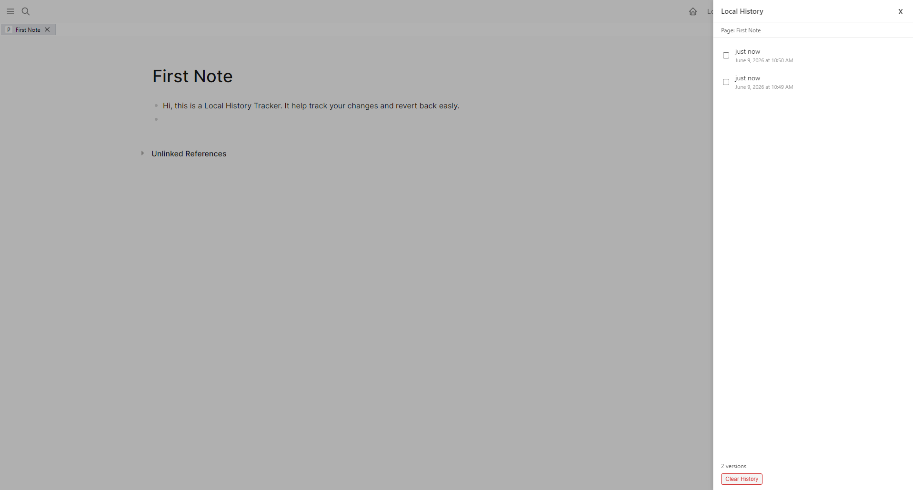
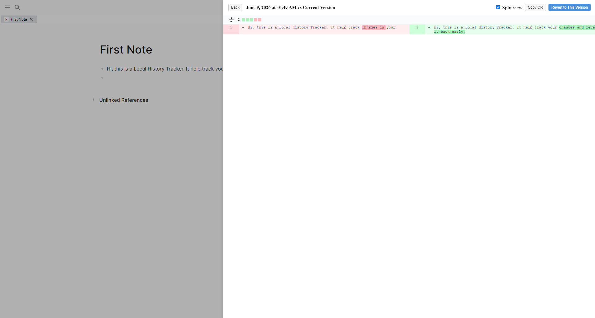

# logseq-local-history

A Logseq plugin to track changes. It allows you to track your changes and revert to previous versions if needed.

## Screenshots

## Features

- Track logseq pages changes.
- View the history timestamps of your changes in logseq sidebar.
    - logseq menu entry: Show Local History.
    - Shortcut to open the sidebar: `Ctrl+Shift+L` (Windows/Linux) or `Cmd+Shift+L` (Mac).
- View the differences between versions (2 selected versions/selected version vs current version) of your changes in a diff view.
- Undo/redo your changes in diff view.
- Revert to previous versions of your changes.
- Setting to configure the maximum number of versions to keep for each page.
